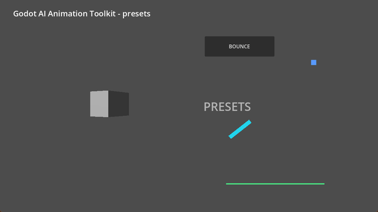
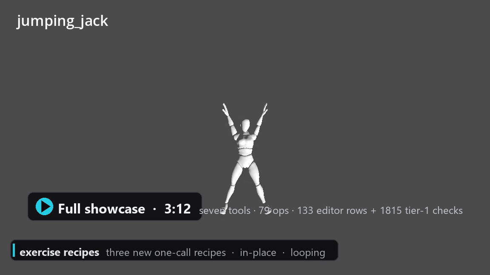

# Godot AI Animation Toolkit

A standalone [Godot](https://godotengine.org) addon that gives
[Godot AI](https://github.com/hi-godot/godot-ai) agents eight animation tools
(98 ops) — **no core patches**:

- **`animation_presets`** — build clips in one call (the presets scoped out of
  core during the animation PR review: a generalized `pulse` plus `bounce`,
  `orbit`, `sweep`, `drift`, `spin`, `float`, `stagger`, `showcase`).
- **`animation_edit`** — edit any existing clip in place: `retime`, `retarget`,
  `reverse`, `mirror`, `offset`, `ease_range`, `set_interp`, `trim`, `split_at`,
  `merge`, `amplitude`, `loop`, `key_edit`, `cleanup`, plus quality passes
  (`smooth`, `resample`, `add_noise`, `overlap`, `layer`).
- **`animation_fx`** — one-call generators for game feel, UI, sprites and
  audio: `shake`, `zoom_punch`, `hit_flash`, `damage_bar`, `typewriter`,
  `progress_fill`, `counter`, `dialog_pop`, `transition`, `wave`, `spring`,
  `pendulum`, `path_follow`, `flipbook`, `sprite_frames`, `audio_cue`.
- **`animation_graph`** — AnimationTree authoring: `state_machine`, `blend_space`,
  `blend_tree`, `wire`, `graph_get`, plus `locomotion`, `one_shot_layer` and
  `additive_lean` setups.
- **`animation_library`** — reusable templates (`template_save/apply/list/delete`)
  and JSON clip specs (`spec_export/import/apply`).
- **`animation_rig`** — skeletons from scratch (`rig_chain`), IK (`ik_setup`),
  spring bones, look-at and retargeting modifiers, skeleton poses
  (`pose_save`, `pose_apply`, `pose_blend`, `pose_to_clip`, `pose_list`,
  `rig_get`), procedural recipes (`walk_cycle`, `idle_breathing`, `blink`,
  `jumping_jack`, `squat`, `punch`) and `bake_pose_sequence` (live modifiers →
  a plain clip).
- **`animation_motion`** — procedural humanoid locomotion and idle:
  `walk_cycle`, `run_cycle`, `idle_cycle` and a generic `cycle` build densely
  sampled clips with two-bone IK leg solves (planted feet), pelvis
  bob/sway/yaw/roll, counter-rotating torso, proper arm swing with forward
  elbow follow-through, and an idle that looks around and twists the torso;
  `style`/`overrides` tune the motion, `root_motion` keys forward travel,
  `character_setup` builds idle + walk + run and the locomotion tree in one
  call, and `secondary_motion` bakes offline spring bones (hair/tail/cloth)
  into a clip.
- **`animation_inspect`** — read-only reasoning and QA: `describe`, `timeline`,
  `audit` (broken paths, dead clips, loop seams, autoplay conflicts),
  `compare`, `stats`, `motion_report` (key density, peaks, seam pops,
  hemisphere flips), `rig_profile` (bone roles/candidates, T/A pose, limb
  reach, capabilities; saves a reusable profile), `sample` (FK probe: world
  bone positions, foot heights, contact windows), `dry_run` (run any op without
  committing), `help`.

All eight sit on one declarative clip-spec engine, so every op is a pure
spec → spec transform and each mutating call is one scene-pinned undo action.

```json
{"tool": "custom_animation_presets", "params": {
  "op": "bounce",
  "player_path": "/Main/HUD",
  "target_path": "Button",
  "intensity": 0.2
}}
```

```json
{"tool": "custom_animation_edit", "params": {
  "op": "retime",
  "player_path": "/Main/HUD",
  "animation_name": "open",
  "factor": 0.5
}}
```



*`op="showcase"` builds the scene above — seven nodes, seven autoplaying clips, one undo step.*

[](https://github.com/michaltomczykowski/godot-ai-animation-toolkit/releases/download/v1.1.0/animation_toolkit_full_showcase.mp4)

**[Full showcase (3:12)](https://github.com/michaltomczykowski/godot-ai-animation-toolkit/releases/download/v1.1.0/animation_toolkit_full_showcase.mp4)**
— every phase in one pass: clips, editing, inspection, generators, graphs, the
project library, rigs, procedural recipes and the exercise recipes, with the CI
results at the end.

## Presets

| op | What it builds | Defaults |
| --- | --- | --- |
| `pulse` | Breathing / ping-pong on any property (`scale` shortcut, or typed `from_value`/`to_value` for `modulate:a`, `position`, `modulate`, …) | `duration=0.4`, `loop_mode="none"` |
| `bounce` | Center-pivot scale overshoot with settle-back — UI press feedback | `intensity=0.15`, `duration=0.4` |
| `orbit` | Circular position orbit (XZ plane for 3D, screen space for 2D/Control) | `radius=1.0` (3D) / `100.0` (2D), `duration=2.0` |
| `sweep` | Full-turn rotation sweep — radar scans, cooldown rings | `turns=1.0`, `duration=1.0` |
| `drift` | One-axis position offset — scanlines, marquee, conveyor | `axis="x"`, `duration=1.0` |
| `spin` | 3D quaternion turn around local Y | `turns=1.0`, `duration=3.0` |
| `float` | 3D bob: rise + scale + turn through the transform | `height=0.7`, `scale=1.25`, `duration=2.4` |
| `stagger` | Reveal a list of targets one after another in **one clip** | `effect="fade_in"`, `stagger=0.06`, `duration=0.3` |
| `showcase` | Builds a runnable demo of every preset (7 nodes + 7 autoplaying clips) | `name="AnimationShowcase"` |

Every preset:

- builds **one** `Animation` clip with typed keys and named transitions
  (`linear` / `ease_in` / `ease_out` / `ease_in_out`);
- commits **one scene-pinned undo action** — a single Ctrl-Z removes the clip
  (and any auto-created library);
- recenters a Control's `pivot_offset` for `bounce`/`sweep` **inside the same
  action**, so the pop/rotation starts from the widget's middle;
- starts from the target's *current* transform (scale/rotation/position), so a
  preset never snaps the node to identity.

(`showcase` is the exception: it builds a whole demo subtree in one action
instead of a single clip.)

## Editing existing clips

`animation_edit` works on any clip in any `AnimationPlayer` — including
hand-authored ones — and commits one scene-pinned undo action per call.

| op | What it does |
| --- | --- |
| `retime` | Scale the timeline by `factor` or to `length` (optionally `keys_only`). |
| `retarget` | Rename a node's tracks, or bulk-remap a subtree prefix after a refactor. |
| `reverse` | Play the clip backwards. |
| `mirror` | Mirror position/rotation (optionally scale) across a plane, about a pivot. |
| `offset` | Shift every key in time, optionally wrapping inside the loop. |
| `ease_range` | Set per-key transitions inside a time range. |
| `set_interp` | Track-level interpolation (linear / nearest / cubic for 3D transform tracks). |
| `trim` | Keep a time range, with sampled boundary keys. |
| `split_at` | Cut one clip into two. |
| `merge` | Concatenate clips (optionally across players) into one. |
| `amplitude` | Scale key deltas about a baseline. |
| `loop` | Set the loop mode, optionally making a linear loop seamless. |
| `key_edit` | Add / set / remove / move a single key. |
| `cleanup` | Drop redundant keys and empty tracks. |
| `smooth` | Soften key values toward their neighbours — noise/follow-through cleanup. |
| `resample` | Rebuild value tracks at a fixed fps through the engine's interpolator (transitions and cubic preserved). |
| `add_noise` | Seeded smooth micro-motion on value keys (breathing, tremor). |
| `overlap` | Delay one node/subtree's tracks by `delay` seconds — per-limb follow-through. |
| `layer` | Combine another clip: `add` its delta from its first key, or `mix` toward it by `weight`. |

Clips containing bezier / blend-shape / animation tracks (or compressed tracks)
are refused with a clear error rather than rewritten lossily.

## Game feel, UI, sprites and audio

`animation_fx` covers the rest of the everyday animation work: camera shake and
punches, hit flashes, delayed damage bars, typewriter text, progress fills,
rolling counters, dialog entrances, screen transitions, cascading waves, springs,
pendulums, path following, sprite flipbooks, spritesheet slicing and audio cues.
Same contract as the presets — one undo action per call, `dry_run` supported.

```json
{"tool": "custom_animation_fx", "params": {
  "op": "shake",
  "player_path": "/Main",
  "target_path": "Camera2D",
  "intensity": 10,
  "seed": 7
}}
```

## A living menu (example)

[**Video: menu demo (0:47)**](https://github.com/michaltomczykowski/godot-ai-animation-toolkit/releases/download/v1.1.0/animation_toolkit_menu_demo.mp4)
— a game menu whose every reaction is an ordinary toolkit clip, driven by
synthetic mouse input: an aurora shader and GPU motes for the backdrop, an
entry `stagger`, a sliding selection highlight, hover pops from a saved
`template_apply`, `bounce` + `hit_flash` with a camera `zoom_punch` on press, a
`transition` wipe into a `progress_fill`/`counter` loading screen, `dialog_pop`
options and credits cards over a dimming scrim (the cards close by replaying
their clip reversed with `animation_edit reverse`), and a quit that `shake`s
the screen.

The scene ships in the test project: open `test_project/demo_menu.tscn` and run
it — 24 animation players, every clip authored with the toolkit, plus one small
driver that replays the interaction timeline.

## AnimationTree graphs

`animation_graph` builds and inspects the graph layer: state machines with
conditions and cross-fades, 1D/2D blend spaces, recursive blend trees, and
ready-made locomotion / one-shot / additive layer setups. It creates and wires
the `AnimationTree` for you, exposes the resulting parameter paths, and flags
graphs that reference clips the player does not have.

```json
{"tool": "custom_animation_graph", "params": {
  "op": "locomotion",
  "player_path": "/Main",
  "mode": "state_machine"
}}
```

## Reuse and interchange

`animation_library` turns one-off calls into project knowledge: save any
presets/fx/motion/rig call as a named template and apply it later to other
players or targets with overrides, and move whole clips in and out of a typed
JSON format (`spec_export` / `spec_import` / `spec_apply`, with optional track
remapping).

```json
{"tool": "custom_animation_library", "params": {
  "op": "template_save",
  "name": "button_pop",
  "tool": "animation_presets",
  "forward_op": "bounce",
  "intensity": 0.2
}}
```

## Rigs, poses and procedural recipes

`animation_rig` builds and drives skeletons: bones from a spec or a node
subtree (`rig_chain`), IK (`ik_setup` — two-bone and chain solvers), spring
bones, look-at and retargeting modifiers, and skeleton poses as portable
rest-relative data. On top of that sit seven sparse rig recipes — `walk_cycle`
(with `arm_down` for T-pose rigs), `idle_breathing`, `blink`, `jumping_jack`,
`squat`, `punch` and `bake_pose_sequence`, which samples a source clip with the
active modifiers running and keys the final pose into a new clip. (For smooth
character locomotion, see `animation_motion` below.)

Bone clips are ordinary transform tracks, so everything else in the toolkit
works on them — `retime`, `mirror`, `reverse`, `amplitude`, JSON export,
templates.

```json
{"tool": "custom_animation_rig", "params": {
  "op": "pose_to_clip",
  "player_path": "/Main/Rig/AnimationPlayer",
  "skeleton_path": "/Main/Rig/Skeleton3D",
  "animation_name": "wave",
  "loop_mode": "linear",
  "keys": [{"name": "idle", "time": 0.0}, {"name": "wave_mid", "time": 0.5}, {"name": "idle", "time": 1.0}]
}}
```

```json
{"tool": "custom_animation_rig", "params": {
  "op": "squat",
  "player_path": "/Main/Rig/AnimationPlayer",
  "skeleton_path": "/Main/Rig/Skeleton3D",
  "animation_name": "squat",
  "duration": 2.0,
  "bob": 0.32,
  "loop_mode": "linear"
}}
```

## Procedural motion (3D character cycles)

[**Video: dummy motion pack (0:40)**](https://github.com/michaltomczykowski/godot-ai-animation-toolkit/releases/download/v1.3.0/animation_toolkit_motion_pack.mp4)
— jump, turn, strafe and a speed-driven walk recorded on the bundled human
dummy: one-shot moves with phase markers, planted feet, toe roll and shoulder
follow-through, all from one call each.

`animation_motion` is the character-motion family: gaits (`walk_cycle`,
`run_cycle`, `strafe_cycle`), an `idle_cycle`, one-shots (`jump`,
`turn_cycle`), gait transitions (`walk_start` / `walk_stop`) and `cycle` build
smooth clips from analytic drivers instead of a handful of hand-tuned keys.
Legs are solved per sample by a two-bone IK so the stance foot stays planted and
rolls heel-to-toe; the pelvis bobs/sways/yaws/rolls, the chest counter-rotates
and the arms swing about a sagittal hinge with elbow and clavicle
follow-through. Pass `speed` (m/s) and the stride is solved for you; `style`
(`relaxed` / `heavy` / `sneaky`) and `overrides` tune everything; gaits emit
`contact`/`toe_off`/`passing` phase markers for footsteps and blends;
`root_motion` keys forward travel and wires `AnimationPlayer.root_motion_track`
in the same undo action; `secondary_motion` bakes offline spring bones (hair,
tails, cloth) into any clip; `character_setup` goes from a bare rig to a
playable locomotion set — idle + walk + run (optionally jump/turn), a speed
blend space, the `AnimationTree` and the root-motion track — in one call and one
undo. T-pose rigs get their arms lowered automatically.

```json
{"tool": "custom_animation_motion", "params": {
  "op": "character_setup",
  "player_path": "/Main/Rig/AnimationPlayer",
  "skeleton_path": "/Main/Rig/Skeleton3D",
  "speed": 1.4,
  "run_speed": 4.0,
  "include_jump": true
}}
```

```json
{"tool": "custom_animation_motion", "params": {
  "op": "walk_cycle",
  "player_path": "/Main/Rig/AnimationPlayer",
  "skeleton_path": "/Main/Rig/Skeleton3D",
  "animation_name": "walk",
  "duration": 1.0,
  "loop_mode": "linear"
}}
```

## Inspecting and auditing

`animation_inspect` is read-only, so an agent can look before it edits — and
`dry_run` shows exactly what a generator or edit call would produce without
committing it. `audit` scans a player or the whole scene and reports findings
with a severity, a code and a `fix` hint naming the op that resolves them
(e.g. a linear loop that pops at the seam → `animation_edit loop
make_seamless=true`). `rig_profile` tells an agent what a rig can do before it
tries (roles and candidates, T/A pose, limb reach, capabilities, suggested
ops — and a saved profile the rig/motion ops reuse), while `sample` FK-probes a
clip numerically (world bone positions, foot heights, contact windows) so
motion can be verified without rendering it.

```json
{"tool": "custom_animation_inspect", "params": {
  "op": "audit",
  "severity": "warning"
}}
```

## Install

1. Copy `addons/godot_ai_animation/` into your project's `addons/` folder.
2. Install and enable [Godot AI](https://github.com/hi-godot/godot-ai)
   (`>= 4.1.0`) in the same project.
3. Enable **Godot AI Animation Toolkit** in *Project → Project Settings →
   Plugins* (either order works).

Agents reach each tool as a promoted first-class tool (e.g.
`custom_animation_motion`) or through `custom_manage(op="list"/"invoke")`. The
Godot AI dock's Tools tab lists them with enable/disable toggles.

## Requirements

| | |
| --- | --- |
| Godot | 4.5 – 4.7 |
| Godot AI | `>= 4.1.0` (custom-tools registry) |
| Platform | any (no OS-specific code) |

The addon is **self-contained**: it uses the Godot AI custom-tools registration
API only, never core animation-handler internals, and loads cleanly (with a
warning) when Godot AI is absent.

## Development

```powershell
# Link the core addon + this addon into the test project (Windows)
./tools/setup_dev.ps1 -GodotAiPath C:\path\to\godot-ai

# Tier 1: pure helpers, headless, no editor
./tools/test_tier1.ps1

# Tier 2: editor suite (open test_project in the editor, then)
#   godot-ai test_run suite=animation_presets
```

`test_project/` is a Godot project wired to both addons; `tests/` holds the
editor suites (144 rows across all eight tools) and the headless checks
(`tier1_value_codec.gd`, `tier1_spec_modifiers.gd`, `tier1_fx_specs.gd`,
`tier1_graph_builders.gd`, `tier1_spec_json.gd`, `tier1_pose_math.gd`,
`tier1_motion_drivers.gd`, `tier1_quality_modifiers.gd`, 2100+ checks). The
`demo_*.tscn` scenes are the ones recorded for the showcase videos — each is one
toolkit call (plus autoplay) or one built demo subtree.

```powershell
# Regenerate docs/op-index.md from the op registry (the single source of truth)
./tools/gen_docs.ps1
```

## Documentation

- [`docs/tool-reference.md`](docs/tool-reference.md) — curated reference for
  every tool, with semantics per op.
- [`docs/op-index.md`](docs/op-index.md) — generated per-op parameter index
  (freshness-checked by the tier-1 suite).
- [`docs/recipes.md`](docs/recipes.md) — core recipes → preset calls, with the
  demo GIFs.
- [`ROADMAP.md`](ROADMAP.md) — the plan from presets to a full animation toolkit.
- [`addons/godot_ai_animation/README.md`](addons/godot_ai_animation/README.md) —
  addon-level notes and architecture.

## Licence

MIT — see [`LICENSE`](LICENSE).
