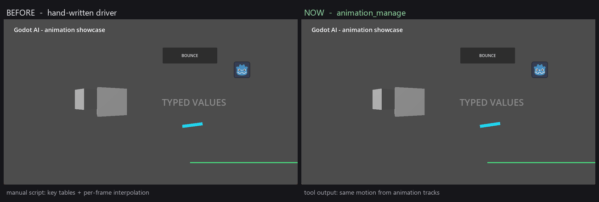

# Recipes and presets


*`animation_presets(op="showcase")` builds the scene above in one call — seven
nodes and seven autoplaying clips, one undo step. Run the current scene (F6) to
watch it.*

## Recipe → preset

The core Godot AI docs describe four motion **recipes** built from
`animation_create` + `add_property_track`. The toolkit turns each into a
one-call preset:

| Recipe (core docs) | Preset call |
| --- | --- |
| Bounce — press feedback | `{"op": "bounce", "player_path": "...", "target_path": "Button", "intensity": 0.2}` |
| Orbit — circular position | `{"op": "orbit", "player_path": "...", "target_path": "Marker", "radius": 1.5, "loop_mode": "linear"}` |
| Sweep — radar / cooldown ring | `{"op": "sweep", "player_path": "...", "target_path": "RadarPivot", "loop_mode": "linear"}` |
| Drift — scanline / marquee | `{"op": "drift", "player_path": "...", "target_path": "Scanline", "axis": "x", "distance": 480.0, "loop_mode": "pingpong"}` |

Two more presets cover the typed-track demos from the core showcase:

| Effect | Preset call |
| --- | --- |
| Quaternion spin (3D) | `{"op": "spin", "player_path": "...", "target_path": "Cube", "loop_mode": "linear"}` |
| Transform float (3D) | `{"op": "float", "player_path": "...", "target_path": "Pickup", "height": 0.4, "loop_mode": "pingpong"}` |
| Breathing / hover pulse | `{"op": "pulse", "player_path": "...", "target_path": "Label", "property": "modulate:a", "from_value": 0.2, "to_value": 1.0, "loop_mode": "pingpong"}` |

## Staggered reveals (many targets, one clip)

Lists, grids and menus usually want the same entrance applied to N nodes with a
small delay between them. Doing that with per-node calls means N clips and N
undo steps; `stagger` builds it as **one clip with one track per target**:

```json
{"op": "stagger", "params": {
  "op": "stagger",
  "player_path": "/Main/HUD",
  "target_paths": ["Item1", "Item2", "Item3", "Item4"],
  "effect": "slide_in",
  "direction": "left",
  "stagger": 0.08,
  "duration": 0.3
}}
```

Effects: `fade_in` (`modulate:a` 0 → current alpha), `slide_in` (from one
`distance` off in `direction`, default 100 px / 1.0 unit), `pop_in` (scale from
0.6× to the target's baseline). Each item holds its start value until its
delay, so the reveal reads as a wave; the clip length is
`(n-1) * stagger + duration`.

`use_selection: true` replaces `target_paths` with the editor's current
selection (in selection order) — handy for "stagger everything I just
selected".

## Why a preset instead of raw keyframes



*Same motion either way — the difference is what it takes to author it.*

The core animation tooling can express all of this with
`animation_create` + `add_property_track`, and a hand-written `_process`
driver can too. The presets exist so an agent (or a person) does not have to:

- pick the right keyframe times and transition names per effect
  (`ease_out` / `ease_in_out` curves, 16-segment circle sampling, ping-pong
  phases);
- remember that a Control scales/rotates around `pivot_offset` — and recenter
  it in the same undo step;
- start from the target's **current** transform instead of snapping it to
  identity;
- get the typed key shapes right (`Vector2` vs `Vector3` vs `float` vs
  `Quaternion`).

## The showcase op

```json
{"op": "showcase", "params": {"op": "showcase", "name": "Presets"}}
```

Builds under the edited scene root (or `parent_path`):

- `BounceButton` — Control, `bounce` clip, pivot recentered
- `OrbitDot` — ColorRect, `orbit` clip (radius 60 px)
- `SweepPivot`/`SweepBar` — `sweep` clip (linear loop)
- `DriftLine` — `drift` clip (ping-pong, x axis)
- `PulseLabel` — `pulse` clip on `modulate:a` (ping-pong)
- `World3D` + `FloatCube` — Camera3D, light and a cube with the `float` clip
  (bob + scale + half turn, ping-pong)
- `World3D` + `SpinCube` — a second cube with the `spin` clip (linear loop)

Seven `AnimationPlayer`s autoplay, the whole subtree is one undo step, and
`test_project/showcase.tscn` in this repository is exactly this output.

## Editing recipes (`animation_edit`)

```json
// The node was renamed: fix every track in one call
{"op": "animation_edit", "params": {"op": "retarget", "player_path": "/Main/HUD",
  "animation_name": "open", "from_path": "Panel", "to_path": "Popup/Panel",
  "mode": "prefix"}}

// The animation feels sluggish: play it twice as fast
{"op": "animation_edit", "params": {"op": "retime", "player_path": "/Main/HUD",
  "animation_name": "open", "factor": 0.5}}

// A walk cycle pops at the loop seam: copy the first pose onto the last key
{"op": "animation_edit", "params": {"op": "loop", "player_path": "/Main",
  "animation_name": "walk", "loop_mode": "linear", "make_seamless": true}}

// The bounce is too aggressive for a small button: halve every delta
{"op": "animation_edit", "params": {"op": "amplitude", "player_path": "/Main/HUD",
  "animation_name": "bounce", "factor": 0.5}}

// Split an intro into a hold + a loop, then stitch them back with a beat
{"op": "animation_edit", "params": {"op": "split_at", "player_path": "/Main",
  "animation_name": "intro", "time": 0.8, "head_name": "intro_head"}}
```

Every call is one undo step, and clips the toolkit cannot represent (bezier /
blend-shape / compressed tracks) are refused instead of being rewritten.
